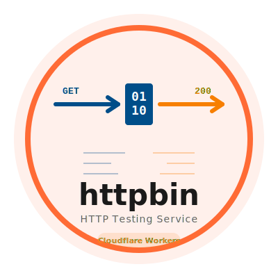

## [EdgeBin](https://github.com/jiacai2050/edgebin)

<p align="center">
  <a href="https://edgebin.liujiacai.net/"></a>
</p>

edgebin is a simple, high-performance HTTP utility designed to test your networking stack, with a focus on Edge deployment.

Inspired by the pioneering [httpbin.org](https://httpbin.org), it leverages the power of edge computing (Cloudflare Workers) to deliver fast, reliable testing capabilities tailored for modern distributed networks.

## Features

Supports most of the endpoints from the original [httpbin.org](https://httpbin.org), including:

- HTTP methods
- Authentication
- Request inspection
- Response inspection
- Dynamic data
- Status codes
- Redirects
- Cookies
- Cache
- Anything

All endpoints accept any HTTP method. Additionally, it includes features not found in the original httpbin:

- IP Geolocation:

  ```bash
  curl https://edgebin.liujiacai.net/ip
  ```

  Output:

  ```json
  {
    "origin": "2408:8240:e10:947c:2806:6bb2:c222:343c",
    "continent": "AS",
    "latitude": "30.29365",
    "longitude": "120.16142",
    "country": "CN",
    "region": "Zhejiang",
    "regionCode": "ZJ",
    "city": "Hangzhou",
    "postalCode": "310000",
    "timezone": "Asia/Shanghai",
    "asn": 4837,
    "asOrganization": "China Unicom",
    "colo": "LAX"
  }
  ```

- WebSocket Echo:

  This endpoint echoes back any message sent to it over a WebSocket connection. You can test it using [wscat](https://github.com/websockets/wscat):

  ```bash
  wscat -c wss://edgebin.liujiacai.net/ws
  ```

### Frequently Used Endpoints

- `/get`: Returns GET data
- `/ip`: Returns the requester's IP address
- `/ipgeo`: Returns the requester's IP address and geolocation information
- `/user-agent`: Returns the requester's User-Agent
- `/headers`: Returns the requester's HTTP headers
- `/status/:code`: Returns a response with the given status code
- `/anything`: Returns anything that was sent in the request
- `/delay/:n`: Delays responding for `n` seconds
- `/redirect/:n`: Redirects `n` times
- `/basic-auth/:user/:passwd`: Challenges HTTP Basic Auth
- `/bearer`: Challenges HTTP Bearer Auth
- `/cache/:max-age`: Returns a response with `Cache-Control: public, max-age=60`
- `/response-headers?key=value`: Returns a response with the given headers
- `/bytes/:n`: Returns `n` random bytes
- `/date`: Returns current date and time.
  Supports the following query parameters to control output:
  - `format`: Output format. One of `iso`, `locale`, `ts`, `timestamp`, `utc`. Default is `iso`.
  - `locale`: [BCP47 locale](https://www.rfc-editor.org/rfc/bcp/bcp47.txt) string, e.g., `en-US`, `zh-CN`. Used when `format=locale`.
  - `timeZone`: [IANA time zone](https://en.wikipedia.org/wiki/List_of_tz_database_time_zones), e.g., `Asia/Shanghai`.
- `/xml`: Returns a sample XML document
- `/html`: Returns a sample HTML document
- `/json`: Returns a sample JSON document
- `/gzip`: Returns a gzip-encoded response
- `/brotli`: Returns a brotli-encoded response
- `/deflate`: Returns a deflate-encoded response
- `/anything/:anything`: Returns anything that was sent in the request
- `/cookies`: Returns the requester's cookies
- `/cookies/set?name=value`: Sets cookies and redirects to `/cookies`
- `/cookies/delete?name=value`: Deletes cookies and redirects to `/cookies`
- `/image/:type`: Returns a random image of the given type (png, jpeg, webp, svg)

If you find an endpoint is missing or notice any unexpected behavior, we welcome you to [open an issue](https://github.com/jiacai2050/httpbin/issues) or [submit a pull request](https://github.com/jiacai2050/httpbin/pulls).

## Deploy

Feel free to deploy your own instance of httpbin. The free tier of Cloudflare Workers is sufficient for most use cases.

[](https://deploy.workers.cloudflare.com/?url=https://github.com/jiacai2050/httpbin)

If you'd like to share your public instance, please [let us know](https://github.com/jiacai2050/httpbin/discussions/4) and we'll add it to the list.

### Public Instances

| Instance                        | Maintainer                                   |
| ------------------------------- | -------------------------------------------- |
| <https://edgebin.liujiacai.net> | [@jiacai2050](https://github.com/jiacai2050) |

## Development

```bash
# clone the repo and install dependencies
git clone https://github.com/jiacai2050/edgebin.git && cd edgebin
npm install

# start development server, listen on http://localhost:8787
npm run dev

# Deploy to Cloudflare Workers
# Make sure to set up your Cloudflare Workers environment first
# https://developers.cloudflare.com/workers/get-started/guide/
npm run deploy
```

In the future, we may support other edge platforms like Vercel Edge Functions and Deno Deploy.

## License

[MIT License](LICENSE)
